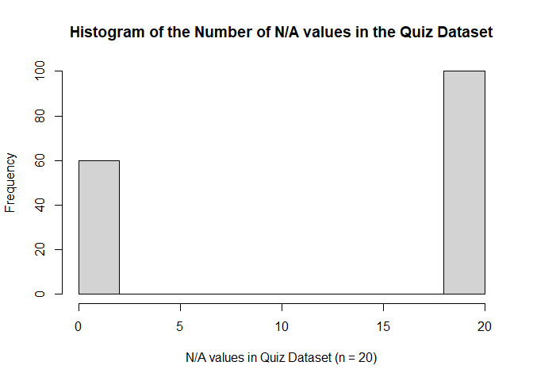
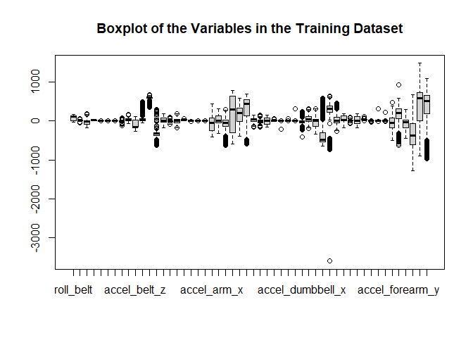

## Data Loading and Summary

The first step is loading the data and getting the dimension for both files to get a feel for the datasets. 


```r
quiz <- read.csv("pml-testing.csv")
trainall <- read.csv(("pml-training.csv"))
```

The datasets are large with 160 variables each. The training set has 19622 rows, which is large. This will facilitate later splitting into data sets for training, testing (model stacking) and validating. 

## Feature Selection

We are not to train our models on the test set, and of course we won't. However, we should use variables for which we expect to have information as it makes little sense to build a model requiring data that won't be available in the test set. With the end goal of accurately predicting the values for the test set, we want to reduce additional sources of error in the test set. Imputation can induce error, and predictions don't do well with missing values, so we want to first choose variables with few missing values in the test set. I calculate the numbers of N/A values in each variable in the test set (which I labeled quiz to differentiate it from the test set I will use for model stacking).


```r
quizna <- apply(quiz, 2, is.na)
quizna <- apply(quizna, 2, sum)
hist(quizna, main = "Histogram of the Number of N/A values in the Quiz Dataset", xlab = "N/A values in Quiz Dataset (n = 20)")
```

<!-- -->

Looking at the histogram, the variables in the quiz data set are either fully populated with data, or not populated at all (all N/A). we can reduce our training dataset to only those variables available for the quiz data set.


```r
quizna <- quizna > 0
trainnotna <- trainall[,grep("FALSE", quizna)]
trainna <- apply(trainnotna, 2, is.na)
trainna <- apply(trainna, 2, sum)
sum(trainna)
```

```
## [1] 0
```

```r
namecompare <- colnames(quiz) != colnames(trainall)
sum(namecompare)
```

```
## [1] 1
```

This reduction also results in no NAs in the reduced training data set. I next check that the data sets have the same columns, which they do, except for one. In the quiz data set, the final column is a mirror of the first column, while in the training data set the final column is the response variable.  

The goal of the project is to predict activity type based on the sensor readings from the subjects. The subjects in the training set have conducted a specfiic activity during a given time period. The time period information and subject names are removed in this next chunk to reduce feature numbers and spurious results.


```r
trainnotna <- trainnotna[,-c(1:7)]
```

## Data visualization


```r
boxplot(trainnotna[,-53], main = "Boxplot of the Variables in the Training Dataset")
```

<!-- -->

Looking at boxplots of the data, there is a wide variety of scales, centers and skews for the variables. Some preprocessing will be necessary for best predictions. All of the pedictors are numeric. The only factor variable is the response variable, classe.

## Data slicing
We now need to split the initially provided training data set into trainnig, test and validation. I'm using three data sets as I intend to build a variety of models on the training set, use the test set to stack them and then use the validation set as an approximation of out of sample error for the stacked model.


```r
set.seed(429)
intrain <- createDataPartition(y=trainnotna$classe, p = .6, list = FALSE)
training <- trainnotna[intrain,]
testandvalidate <- trainnotna[-intrain,]
intest <- createDataPartition(y=testandvalidate$classe, p = .5, list = FALSE)
testing <- testandvalidate[intest, ]
validating <- testandvalidate[-intest, ]
```

## Initial Model building
The data is now cleaned and sliced and ready to build models. We've seen throughout the class that combinations of models tend to be most accurate, if less interpretable. We're concerned with accuracy, so I'm going to build a random forrest, a stochastic gradient boosting model and a linear discriminant analysis. I use BoxCox to preprocess to better normalize the data. I'll train the three models on the training slice, then use the testing slice to stack them and the validating slice for the estimate of out of sample error.


```r
modrf <- train(classe ~ ., data = training, method = "rf", preProcess= "BoxCox", tuneGrid=data.frame(mtry=3))
modgbm <- train(classe ~ ., data = training, method = "gbm", preProcess= "BoxCox", verbose = FALSE)
modlda <- train(classe ~ ., data = training, method = "lda", preProcess= "BoxCox")
```

## Stacked Model Building

```r
predrf <- predict(modrf, newdata = testing)
predgbm <- predict(modgbm, newdata = testing)
predlda <- predict(modlda, newdata = testing)
preddf <- data.frame(predrf, predgbm, predlda, classe=testing$classe)
combomod <- train(classe ~., method = "rf", data = preddf)
```

## Validation for an estimate of out of sample error


```r
vpredrf <- predict(modrf, newdata = validating)
vpredgbm <- predict(modgbm, newdata = validating)
vpredlda <- predict(modlda, newdata = validating)
vpreddf <- data.frame(predrf=vpredrf, predgbm=vpredgbm, predlda=vpredlda)
vcombopred <- data.frame(predict(combomod, vpreddf))
vcombopred$classe <- validating$classe
colnames(vcombopred) <- c("predict", "classe")
comboaccuracy <- 1 - (round(sum(vcombopred$classe != vcombopred$predict)/nrow(vcombopred),3))
```

Using the validating portion of the split training data set, I estimate my combined model to have an out of sample accuracy rate of approximately 0.992.

## Quiz set prep


```r
quiznotna <- quiz[,grep("FALSE", quizna)]
quiznotna <- quiznotna[,-c(1:7, 60)]
qpredrf <- predict(modrf, newdata = quiznotna)
qpredgbm <- predict(modgbm, newdata = quiznotna)
qpredlda <- predict(modlda, newdata = quiznotna)
qpreddf <- data.frame(predrf=qpredrf, predgbm=qpredgbm, predlda=qpredlda)
```

The results of the quiz predictions are excluded in the spirit of the Coursera honor code, as that is a separate assignment.
